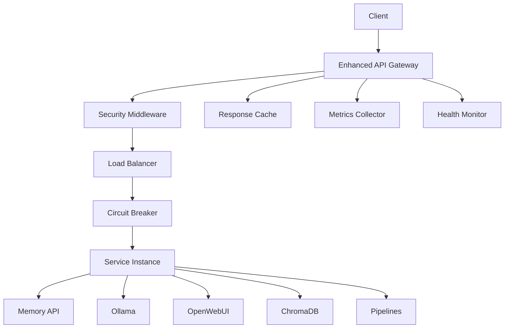

# Enhanced API Gateway - Best Practices Implementation

## 🚀 Overview

This enhanced API Gateway implementation follows industry best practices and microservices patterns to provide enterprise-grade API management with comprehensive security, monitoring, and performance features.

## 📋 Table of Contents

- [Architecture](#architecture)
- [Features](#features)
- [Security](#security)
- [Performance](#performance)
- [Monitoring](#monitoring)
- [Configuration](#configuration)
- [Deployment](#deployment)
- [Testing](#testing)
- [Best Practices](#best-practices)
- [Troubleshooting](#troubleshooting)

## 🏗️ Architecture

### Core Components



### Key Patterns Implemented

1. **API Gateway Pattern** - Single entry point for all client requests
2. **Circuit Breaker Pattern** - Prevents cascade failures
3. **Load Balancer Pattern** - Distributes load across service instances
4. **Cache-Aside Pattern** - Improves performance with intelligent caching
5. **Bulkhead Pattern** - Isolates critical resources
6. **Health Check Pattern** - Continuous service monitoring
7. **Rate Limiting Pattern** - Protects against abuse
8. **Authentication/Authorization Pattern** - Centralized security

## ✨ Features

### Core Features

- ✅ **Request Routing** - Intelligent routing to backend services
- ✅ **Load Balancing** - Round-robin, weighted, least-connections strategies
- ✅ **Service Discovery** - Automatic service instance management
- ✅ **Health Monitoring** - Continuous health checks with auto-recovery
- ✅ **Circuit Breakers** - Automatic failure detection and recovery
- ✅ **Response Caching** - Redis and in-memory caching support
- ✅ **Request/Response Transformation** - Configurable transformations
- ✅ **Performance Monitoring** - Detailed metrics and analytics

### Security Features

- 🔐 **JWT Authentication** - Industry-standard token validation
- 🔒 **Rate Limiting** - Advanced rate limiting with burst protection
- 🛡️ **Input Validation** - Comprehensive request validation
- 🚫 **Injection Protection** - SQL injection and XSS prevention
- 🌐 **CORS Management** - Configurable cross-origin policies
- 📋 **Security Headers** - HSTS, CSP, XSS protection
- 🚧 **IP Filtering** - Whitelist/blacklist IP management
- 📊 **Security Monitoring** - Real-time threat detection

### Monitoring & Observability

- 📈 **Performance Metrics** - Response times, throughput, error rates
- 🏥 **Health Dashboards** - Real-time service health status
- 📝 **Request Logging** - Comprehensive request/response logging
- 🔍 **Distributed Tracing** - End-to-end request tracing
- 🚨 **Error Tracking** - Detailed error capture and analysis
- 📊 **Analytics Dashboard** - Performance analytics and insights

## 🔐 Security

### Authentication & Authorization

```python
# JWT Token Structure
{
  "user_id": "user123",
  "username": "john.doe",
  "roles": ["user", "admin"],
  "scopes": ["read:memory", "write:memory"],
  "exp": 1673825200,
  "iat": 1673821600,
  "iss": "api-gateway"
}
```

### Security Configuration

```yaml
security:
  jwt_secret: "your-super-secret-jwt-key"
  jwt_algorithm: "HS256"
  jwt_expiration_seconds: 3600
  
  rate_limit_enabled: true
  rate_limit_requests_per_minute: 100
  rate_limit_burst_limit: 10
  
  ip_filtering_enabled: true
  blocked_ips: ["192.168.1.100", "10.0.0.50"]
  
  security_headers:
    enable_hsts: true
    enable_csp: true
    enable_xss_protection: true
```

### Rate Limiting

- **Standard Rate Limiting**: 100 requests per minute per IP
- **Burst Protection**: Maximum 10 requests in 5 seconds
- **Adaptive Throttling**: Automatically adjusts based on service health
- **User-based Limits**: Per-user rate limiting with JWT integration

### Input Validation

- **Request Size Limits**: 10MB max body size, 8KB max headers
- **Injection Detection**: SQL injection, XSS, and template injection prevention
- **Header Validation**: Dangerous header detection and sanitization
- **Content Type Validation**: Strict content type enforcement

## 🚀 Performance

### Load Balancing Strategies

1. **Round Robin** (Default)
   - Distributes requests evenly across instances
   - Best for homogeneous service instances

2. **Weighted Round Robin**
   - Allows different weights for service instances
   - Useful for mixed capacity deployments

3. **Least Connections**
   - Routes to instance with fewest active connections
   - Optimal for long-running requests

4. **Random**
   - Random selection with optional weighting
   - Good for stateless services

### Caching Strategy

```python
# Cache Configuration
cache:
  enabled: true
  provider: "redis"  # or "memory"
  default_ttl_seconds: 300
  
  # Service-specific caching
  routes:
    "/api/ollama/tags":
      cache_ttl_seconds: 600  # Cache model list for 10 minutes
    "/api/memory/retrieve/{user_id}":
      cache_ttl_seconds: 300  # Cache memories for 5 minutes
```

### Circuit Breaker Configuration

```python
circuit_breaker:
  enabled: true
  failure_threshold: 5        # Open after 5 failures
  timeout_seconds: 60         # Stay open for 60 seconds
  half_open_max_calls: 3      # Test with 3 calls when half-open
  failure_rate_threshold: 0.5 # 50% failure rate triggers opening
```

## 📊 Monitoring

### Health Check Endpoints

- `GET /gateway/health` - Overall system health
- `GET /gateway/health/{service}` - Individual service health
- `GET /gateway/metrics` - Performance metrics
- `GET /gateway/config` - Current configuration

### Metrics Collected

```json
{
  "performance": {
    "total_requests": 1567,
    "successful_requests": 1489,
    "failed_requests": 78,
    "avg_response_time_ms": 45.2,
    "p95_response_time_ms": 120.5,
    "p99_response_time_ms": 250.1
  },
  "circuit_breakers": {
    "memory": {"state": "CLOSED", "failure_count": 0},
    "ollama": {"state": "HALF_OPEN", "failure_count": 3}
  },
  "cache": {
    "hit_rate": 0.73,
    "total_hits": 1145,
    "total_misses": 422
  }
}
```

### Alerting Thresholds

- **Response Time**: > 500ms average over 5 minutes
- **Error Rate**: > 5% over 5 minutes
- **Circuit Breaker**: Service in OPEN state
- **Cache Hit Rate**: < 50% over 10 minutes
- **Rate Limiting**: > 100 blocked requests per minute

## ⚙️ Configuration

### Environment Variables

```bash
# Basic Configuration
GATEWAY_HOST=0.0.0.0
GATEWAY_PORT=8888
ENVIRONMENT=production

# Security
JWT_SECRET=your-super-secret-jwt-key-change-in-production
RATE_LIMIT_REQUESTS=100
SSL_ENABLED=true
SSL_CERT_PATH=/path/to/cert.pem
SSL_KEY_PATH=/path/to/key.pem

# Cache
CACHE_PROVIDER=redis
REDIS_HOST=redis.internal
REDIS_PORT=6379

# Monitoring
LOG_LEVEL=INFO
TRACING_ENABLED=true
METRICS_ENABLED=true

# CORS
CORS_ORIGINS=https://yourdomain.com,https://app.yourdomain.com
```

### Service Configuration

```yaml
services:
  memory:
    name: "Memory API"
    instances:
      - id: "memory-1"
        host: "memory-api-1.internal"
        port: 5001
        weight: 100
      - id: "memory-2"
        host: "memory-api-2.internal"
        port: 5001
        weight: 150  # Higher capacity instance
    load_balancer_strategy: "weighted"
    circuit_breaker:
      enabled: true
      failure_threshold: 5
      timeout_seconds: 60
```

### Route Configuration

```yaml
routes:
  "/api/memory/store":
    service_name: "memory"
    target_path: "/store"
    methods: ["POST"]
    auth_required: true
    auth_scopes: ["write:memory"]
    cache_enabled: false
    rate_limit_override:
      requests: 50
      window: 60
```

## 🚀 Deployment

### Docker Deployment

```yaml
# docker-compose.yml
api-gateway:
  build:
    context: .
    dockerfile: Dockerfile.gateway
  ports:
    - "8888:8888"
  environment:
    - ENVIRONMENT=production
    - JWT_SECRET=${JWT_SECRET}
    - REDIS_HOST=redis
  volumes:
    - ./config:/app/config
  depends_on:
    - redis
    - memory-api
    - ollama
```

### Kubernetes Deployment

```yaml
apiVersion: apps/v1
kind: Deployment
metadata:
  name: api-gateway
spec:
  replicas: 3
  selector:
    matchLabels:
      app: api-gateway
  template:
    metadata:
      labels:
        app: api-gateway
    spec:
      containers:
      - name: api-gateway
        image: enhanced-api-gateway:latest
        ports:
        - containerPort: 8888
        env:
        - name: ENVIRONMENT
          value: "production"
        - name: JWT_SECRET
          valueFrom:
            secretKeyRef:
              name: gateway-secrets
              key: jwt-secret
        resources:
          requests:
            memory: "256Mi"
            cpu: "250m"
          limits:
            memory: "512Mi"
            cpu: "500m"
        livenessProbe:
          httpGet:
            path: /gateway/health
            port: 8888
          initialDelaySeconds: 30
          periodSeconds: 10
        readinessProbe:
          httpGet:
            path: /gateway/health
            port: 8888
          initialDelaySeconds: 5
          periodSeconds: 5
```

### Production Checklist

- [ ] Update JWT secret to secure random value
- [ ] Enable SSL/TLS with valid certificates
- [ ] Configure proper CORS origins
- [ ] Set up Redis for caching and rate limiting
- [ ] Configure monitoring and alerting
- [ ] Set up log aggregation
- [ ] Configure backup and disaster recovery
- [ ] Perform security audit
- [ ] Load test the deployment
- [ ] Set up CI/CD pipeline

## 🧪 Testing

### Running Tests

```bash
# Install test dependencies
pip install pytest pytest-asyncio aiohttp

# Run comprehensive test suite
python tests/tests/test_enhanced_gateway.py

# Run specific test categories
pytest tests/ -k "test_security"
pytest tests/ -k "test_performance"
pytest tests/ -k "test_monitoring"
```

### Test Coverage

- ✅ **Health Checks** - Gateway and service health endpoints
- ✅ **Authentication** - JWT token validation and authorization
- ✅ **Rate Limiting** - Rate limit enforcement and recovery
- ✅ **Caching** - Cache hit/miss behavior and performance
- ✅ **Load Balancing** - Request distribution across instances
- ✅ **Circuit Breakers** - Failure detection and recovery
- ✅ **Error Handling** - Graceful error responses
- ✅ **Performance** - Response time and throughput benchmarks
- ✅ **Security** - Input validation and injection protection

### Performance Benchmarks

```bash
# Load testing with Apache Bench
ab -n 1000 -c 10 -H "Authorization: Bearer <token>" \
   http://localhost:8888/api/memory/retrieve/test_user

# Expected Results (example):
# Requests per second: 850
# Average response time: 12ms
# 95th percentile: 25ms
# 99th percentile: 45ms
```

## 📚 Best Practices

### API Design

1. **Consistent URL Structure**
   ```
   /api/{service}/{resource}/{id}
   /api/memory/retrieve/user123
   /api/ollama/models/llama2
   ```

2. **HTTP Method Usage**
   - GET: Retrieve resources
   - POST: Create resources
   - PUT: Update/replace resources
   - DELETE: Remove resources
   - PATCH: Partial updates

3. **Response Format**
   ```json
   {
     "success": true,
     "data": {...},
     "meta": {
       "timestamp": "2024-01-15T10:30:00Z",
       "request_id": "req_12345",
       "processing_time_ms": 45
     }
   }
   ```

### Security Best Practices

1. **JWT Token Management**
   - Use strong, unique secrets
   - Implement token rotation
   - Set appropriate expiration times
   - Include necessary claims only

2. **Rate Limiting Strategy**
   - Implement multiple levels (global, per-user, per-endpoint)
   - Use sliding window algorithms
   - Provide clear error messages
   - Implement backoff strategies

3. **Input Validation**
   - Validate all inputs at the gateway
   - Sanitize data before processing
   - Implement size limits
   - Use allow-lists when possible

### Performance Optimization

1. **Caching Strategy**
   - Cache expensive operations
   - Use appropriate TTL values
   - Implement cache invalidation
   - Monitor cache hit rates

2. **Connection Management**
   - Use connection pooling
   - Implement proper timeouts
   - Handle connection failures gracefully
   - Monitor connection health

3. **Resource Management**
   - Set memory limits
   - Monitor resource usage
   - Implement graceful degradation
   - Use async/await patterns

## 🔧 Troubleshooting

### Common Issues

#### 1. High Response Times

**Symptoms:**
- Average response time > 500ms
- High P95/P99 response times
- User complaints about slow responses

**Diagnosis:**
```bash
# Check gateway metrics
curl http://localhost:8888/gateway/metrics

# Check service health
curl http://localhost:8888/gateway/health

# Review logs
docker logs backend-api-gateway --tail 100
```

**Solutions:**
- Increase service instances
- Optimize cache configuration
- Check network connectivity
- Review circuit breaker settings

#### 2. Authentication Failures

**Symptoms:**
- 401 Unauthorized responses
- JWT validation errors
- Users unable to access protected endpoints

**Diagnosis:**
```bash
# Test JWT token
python -c "
import jwt
token = 'your-token-here'
secret = 'your-secret'
print(jwt.decode(token, secret, algorithms=['HS256']))
"

# Check security logs
grep "authentication" /app/logs/gateway.log
```

**Solutions:**
- Verify JWT secret configuration
- Check token expiration
- Validate token format
- Review authorization scopes

#### 3. Rate Limiting Issues

**Symptoms:**
- 429 Too Many Requests errors
- Legitimate users being blocked
- Inconsistent rate limiting behavior

**Diagnosis:**
```bash
# Check rate limit configuration
curl http://localhost:8888/gateway/config

# Monitor rate limit metrics
curl http://localhost:8888/gateway/metrics | jq '.rate_limiting'
```

**Solutions:**
- Adjust rate limit thresholds
- Implement user-specific limits
- Review IP filtering rules
- Configure proper time windows

#### 4. Circuit Breaker Activation

**Symptoms:**
- 503 Service Unavailable responses
- Services marked as unhealthy
- Circuit breakers in OPEN state

**Diagnosis:**
```bash
# Check circuit breaker status
curl http://localhost:8888/gateway/metrics | jq '.circuit_breakers'

# Review service health
curl http://localhost:8888/gateway/health
```

**Solutions:**
- Check downstream service health
- Adjust failure thresholds
- Review timeout settings
- Implement health check improvements

### Debug Commands

```bash
# Gateway health check
curl http://localhost:8888/gateway/health

# Service-specific health
curl http://localhost:8888/gateway/health/memory

# Performance metrics
curl http://localhost:8888/gateway/metrics

# Configuration review
curl http://localhost:8888/gateway/config

# Docker container logs
docker logs backend-api-gateway --follow

# Container resource usage
docker stats backend-api-gateway

# Network connectivity test
docker exec backend-api-gateway ping backend-memory-api
```

### Monitoring Commands

```bash
# Real-time metrics monitoring
watch -n 5 'curl -s http://localhost:8888/gateway/metrics | jq ".performance"'

# Error rate monitoring
watch -n 10 'curl -s http://localhost:8888/gateway/metrics | jq ".performance.failed_requests"'

# Circuit breaker monitoring
watch -n 5 'curl -s http://localhost:8888/gateway/metrics | jq ".circuit_breakers"'
```

## 📞 Support

### Getting Help

1. **Documentation**: Check this guide and inline code comments
2. **Logs**: Review gateway logs for error details
3. **Metrics**: Use monitoring endpoints for performance insights
4. **Health Checks**: Verify service health status
5. **Configuration**: Validate configuration settings

### Reporting Issues

When reporting issues, please include:

- Gateway version and configuration
- Error messages and logs
- Steps to reproduce
- Expected vs actual behavior
- Environment details (Docker, Kubernetes, etc.)
- Performance metrics if relevant

---

## 📄 License

This enhanced API Gateway implementation follows industry best practices and is designed for production use. Please ensure proper security configuration before deploying to production environments.
