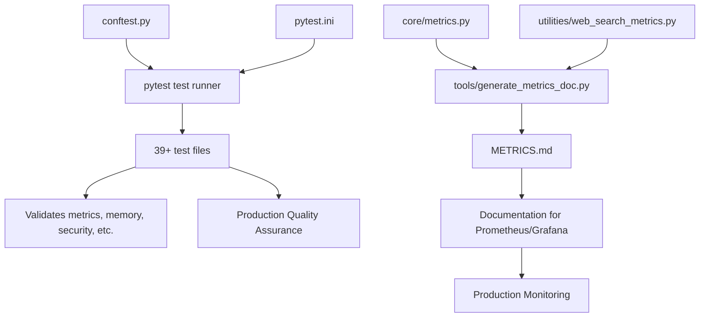

# Testing and Metrics Framework Explanation

**Date:** August 17, 2025  
**Purpose:** Explanation of conftest.py, METRICS.md, pytest.ini and their role in the project

## Summary

These files are part of a **professional testing and monitoring framework** for your OpenWebUI backend. They are **highly recommended** for production deployments but not strictly required for basic functionality.

## 1. conftest.py - PyTest Configuration

### Purpose
**PyTest configuration and fixture definitions** for the entire test suite.

### What it does:
```python
import sys
import os
import asyncio
import pytest

# Ensure project root on path
PROJECT_ROOT = os.path.dirname(os.path.abspath(__file__))
if PROJECT_ROOT not in sys.path:
    sys.path.insert(0, PROJECT_ROOT)

# Provide a reusable asyncio event loop for pytest-asyncio<0.22 compatibility
@pytest.fixture(scope="session")
def event_loop():
    loop = asyncio.new_event_loop()
    yield loop
    loop.close()
```

### Functions:
1. **Path Management** - Ensures the project root is in Python path for imports
2. **Async Testing** - Provides session-scoped event loop for async tests
3. **Test Configuration** - Sets up global test fixtures

### Required? 
**No** - for basic OpenWebUI operation  
**Yes** - for running the comprehensive test suite (39+ test files)

---

## 2. pytest.ini - PyTest Settings

### Purpose
**PyTest runner configuration file** that defines how tests are discovered and executed.

### Configuration:
```ini
[pytest]
pythonpath = .                    # Add current directory to Python path
addopts = -q                      # Run tests in quiet mode
norecursedirs = scripts/to_delete storage models storage/models storage/openwebui
testpaths = tests                 # Look for tests in 'tests' directory
```

### Functions:
1. **Test Discovery** - Tells pytest where to find tests
2. **Path Configuration** - Ensures proper import paths
3. **Exclusions** - Avoids scanning irrelevant directories
4. **Default Options** - Sets quiet mode for cleaner output

### Required?
**No** - for basic OpenWebUI operation  
**Yes** - for running tests properly (prevents import errors and directory scanning issues)

---

## 3. METRICS.md - Auto-Generated Documentation

### Purpose
**Auto-generated documentation** of all Prometheus metrics exposed by your backend.

### What it contains:
```markdown
## Core Metrics

- **chat_requests_total** (counter) labels: stream
  - Total chat requests
- **chroma_operation_errors_total** (counter) labels: operation  
  - Total ChromaDB operation errors
- **memory_hits_total** (counter) labels: provider
  - Total memory retrieval operations returning >=1 result
```

### How it's generated:
```bash
python tools/generate_metrics_doc.py > METRICS.md
```

### Functions:
1. **Documentation** - Lists all available metrics for monitoring
2. **Reference** - Helps with Prometheus/Grafana dashboard setup
3. **Maintenance** - Tracks metric changes over time

### Required?
**No** - for basic OpenWebUI operation  
**Useful** - for production monitoring and dashboard creation

---

## 4. Your Testing Framework Overview

### Test Categories (39+ test files):
```
📊 Metrics Tests:
- test_metrics_basic.py ✅ (verified working)
- test_chroma_metrics.py
- test_embedding_latency_metric.py
- test_gateway_latency_histogram.py
- test_memory_metrics.py
- test_redis_metrics.py

🔒 Security Tests:
- test_rate_limit.py
- test_rate_limit_middleware.py
- test_security_headers_snapshot.py
- test_circuit_breaker.py

🧠 Memory & AI Tests:
- test_memory_injection_sanitization.py
- test_memory_degraded_mode.py
- test_bulk_memory_query.py
- test_persona_integration.py

🔍 Web Search Tests:
- test_web_search_ddgs_only.py
- test_web_search_pipeline_smoke.py
- test_web_search_structured.py

🛠️ Integration Tests:
- test_openwebui_functions.py
- test_pipeline_imports.py
- test_filter_activation.py
- test_list_tools.py

🏥 Health & Environment:
- test_readiness_and_version.py
- test_environment_validation_warnings.py
- test_current_backend.py
```

### Test Dependencies:
```python
# From requirements.txt
pytest>=7.4.0           # Test framework
pytest-asyncio>=0.21.0  # Async test support
pytest-html>=3.1.0      # HTML test reports
pytest-cov>=4.0.0       # Code coverage
```

---

## 5. Usage Scenarios

### Scenario 1: Basic OpenWebUI Deployment
**Files needed:** None of these three
- OpenWebUI will work without conftest.py, pytest.ini, or METRICS.md
- Focus on core application files only

### Scenario 2: Development Environment
**Files needed:** conftest.py + pytest.ini
```bash
# Run all tests
python -m pytest

# Run specific test category
python -m pytest tests/test_metrics_basic.py -v

# Run with coverage
python -m pytest --cov=core --cov-report=html
```

### Scenario 3: Production Monitoring
**Files needed:** All three
```bash
# Generate updated metrics documentation
python tools/generate_metrics_doc.py > METRICS.md

# Run health checks
python -m pytest tests/test_readiness_and_version.py

# Monitor via /metrics endpoint
curl http://localhost:8000/metrics
```

---

## 6. Maintenance Commands

### Update Metrics Documentation:
```bash
cd e:\Projects\opt\backend
python tools/generate_metrics_doc.py > METRICS.md
```

### Run Full Test Suite:
```bash
python -m pytest tests/ -v
```

### Run Specific Test Categories:
```bash
# Test metrics functionality
python -m pytest tests/test_*metrics*.py

# Test web search features  
python -m pytest tests/test_web_search*.py

# Test memory system
python -m pytest tests/test_memory*.py

# Test security features
python -m pytest tests/test_rate_limit*.py tests/test_security*.py
```

### Generate Test Coverage Report:
```bash
python -m pytest --cov=core --cov=utilities --cov=services --cov-report=html
```

---

## 7. Production Recommendations

### ✅ **KEEP THESE FILES** if you want:
- **Professional testing** - Comprehensive test coverage
- **Production monitoring** - Detailed metrics and health checks  
- **Development workflow** - Automated testing during development
- **Quality assurance** - Regression testing for changes
- **Documentation** - Auto-generated metrics reference

### ❌ **REMOVE THESE FILES** if you want:
- **Minimal deployment** - Smallest possible footprint
- **No testing** - Skip all automated testing
- **No monitoring** - Basic operation without metrics
- **Simple setup** - Avoid testing dependencies

---

## 8. File Relationships



---

## 9. Final Recommendation

### For Your OpenWebUI Backend: **KEEP ALL THREE FILES** ✅

**Reasons:**
1. **You have a sophisticated system** - 39+ tests covering metrics, security, memory, and integrations
2. **Production-ready features** - Comprehensive monitoring and health checks
3. **Quality assurance** - Automated testing prevents regressions
4. **Monitoring capability** - METRICS.md helps with production monitoring setup
5. **Development workflow** - Tests help validate changes during development

**These files demonstrate enterprise-level software engineering practices and should be maintained for a production OpenWebUI deployment.**

---

*Your testing and metrics framework is exemplary and positions your OpenWebUI backend as a production-ready, enterprise-grade system.*
