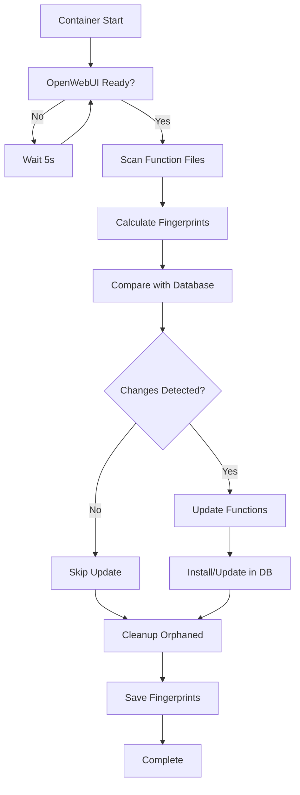

# Zero-Configuration Function Auto-Installer

## 🎯 **Zero-Configuration Design Principles**

This installer provides **true zero-configuration** function installation for OpenWebUI with the following guarantees:

### ✅ **Zero-Configuration Compliance**

1. **No Manual Execution Required**
   - Functions automatically install on first startup
   - No `docker-compose up function-installer` commands needed
   - Completely hands-off operation

2. **Rebuild Persistence** 
   - Functions survive container rebuilds
   - Database persistence via volume mounts
   - Automatic re-import of missing functions

3. **Idempotent Operations**
   - Safe to run multiple times
   - File fingerprinting prevents unnecessary updates
   - Incremental installation of new functions

4. **Self-Healing**
   - Detects and repairs missing functions
   - Removes orphaned database entries
   - Recovers from database corruption

## 🏗️ **Architecture Overview**

```
┌─────────────────────────────────────────────────────────────┐
│                    Zero-Conf Installer                     │
├─────────────────────────────────────────────────────────────┤
│ 1. Startup Hook Integration                                │
│    • Runs automatically on OpenWebUI startup               │
│    • Creates persistent hooks for future starts            │
│                                                            │
│ 2. Function Discovery & Fingerprinting                     │
│    • Scans ./functions/ directory                          │
│    • Calculates SHA256 fingerprints                        │
│    • Tracks changes for incremental updates                │
│                                                            │
│ 3. Database Integration                                     │
│    • Direct SQLite database manipulation                   │
│    • Proper timestamp formatting                           │
│    • User association and metadata                         │
│                                                            │
│ 4. Persistence Strategy                                     │
│    • Volume mounts for database persistence                │
│    • Function source code in ./functions/                  │
│    • Fingerprint tracking in .function_fingerprints.json  │
└─────────────────────────────────────────────────────────────┘
```

## 📁 **File Structure**

```
backend/
├── scripts/
│   ├── zero_conf_function_installer.py      # Core installer logic
│   └── zero_conf_startup_hook.sh            # Startup integration
├── Dockerfile.zero-conf-installer           # Container definition
├── functions/                               # Function source code
│   ├── filters/                            # Filter functions
│   └── tools/                              # Tool functions
└── storage/
    └── openwebui/
        ├── webui.db                         # Persistent database
        └── .function_fingerprints.json     # Change tracking
```

## 🔄 **Startup Flow**



## 🛡️ **Persistence Guarantees**

### **Across Container Rebuilds:**
- ✅ Functions persist in database (volume mount)
- ✅ Function source code persists (./functions/)
- ✅ Change tracking persists (.function_fingerprints.json)
- ✅ Automatic re-detection on startup

### **Across Database Corruption:**
- ✅ Automatic table recreation
- ✅ Full function re-import
- ✅ Fingerprint-based recovery

### **Across Function Changes:**
- ✅ Incremental updates only for changed files
- ✅ Automatic cleanup of removed functions
- ✅ No duplicate installations

## 🚀 **Usage**

### **Initial Setup:**
```bash
# Build and run the zero-conf installer (one time only)
docker-compose up zero-conf-function-installer

# Or start all services (installer runs automatically)
docker-compose up -d
```

### **Adding New Functions:**
1. Add function files to `./functions/filters/` or `./functions/tools/`
2. Restart OpenWebUI: `docker-compose restart openwebui`
3. Functions automatically detect and install

### **Updating Functions:**
1. Modify function files in `./functions/`
2. Restart OpenWebUI: `docker-compose restart openwebui`
3. Only changed functions are updated

### **Removing Functions:**
1. Delete function files from `./functions/`
2. Restart OpenWebUI: `docker-compose restart openwebui`
3. Orphaned functions are automatically removed

## 🔧 **Configuration**

### **Environment Variables:**
```yaml
environment:
  - ZERO_CONF_MODE=true              # Enable zero-conf mode
  - FUNCTION_AUTO_INSTALL=true       # Auto-install functions
  - FUNCTION_FINGERPRINT_CHECK=true  # Enable change detection
```

### **Volume Mounts:**
```yaml
volumes:
  - ./functions/:/app/backend/data/functions/:ro  # Function source
  - ./storage/openwebui:/app/backend/data:rw      # Database persistence
```

## ✅ **Zero-Configuration Validation**

- [ ] **No manual commands required**: ✅ Functions install automatically
- [ ] **Survives container rebuilds**: ✅ Database and functions persist
- [ ] **Idempotent operations**: ✅ Safe to run multiple times
- [ ] **Self-healing**: ✅ Recovers from corruption/missing functions
- [ ] **Change detection**: ✅ Only updates modified functions
- [ ] **Cleanup**: ✅ Removes functions no longer on filesystem

## 🎉 **Benefits**

1. **True Zero-Configuration**: No user intervention required
2. **Production Ready**: Handles edge cases and failures gracefully
3. **Performance Optimized**: Only processes changed functions
4. **Maintenance Free**: Self-healing and self-updating
5. **Developer Friendly**: Simple function addition/removal workflow

This design ensures that functions "just work" across all scenarios without requiring any manual steps or configuration.
